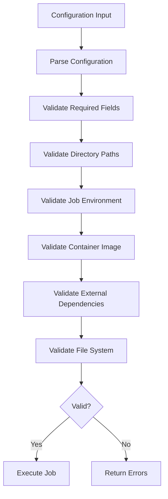

# Runnerlib Design Documentation

## Overview

Runnerlib is a containerized job runner designed as the core of a CI system. It provides a secure, configurable way to execute jobs in isolated containers using docker, with comprehensive configuration management and validation.

## Architecture

### Core Components

```
┌─────────────────┐    ┌─────────────────┐    ┌─────────────────┐
│   CLI Interface │    │  Configuration  │    │   Validation    │
│                 │───▶│    Manager      │───▶│     System      │
│  (cli.py)       │    │  (config.py)    │    │ (validation.py) │
└─────────────────┘    └─────────────────┘    └─────────────────┘
         │                       │                       │
         │                       ▼                       │
         │              ┌─────────────────┐               │
         │              │  Source Prep    │               │
         │              │                 │               │
         │              │ (source_prep.py)│               │
         │              └─────────────────┘               │
         │                       │                       │
         ▼                       ▼                       ▼
┌─────────────────┐    ┌─────────────────┐    ┌─────────────────┐
│   Container     │    │   Git Operations│    │  Container      │
│   Execution     │    │                 │    │  Validation     │
│ (container.py)  │    │  (git_ops.py)   │    │(container_      │
└─────────────────┘    └─────────────────┘    │validation.py)   │
                                              └─────────────────┘
```

## Configuration System

### Configuration Hierarchy

The system implements a three-tier configuration hierarchy:

1. **Defaults** - Built-in reasonable defaults
2. **Environment Variables** - System-level configuration
3. **CLI Arguments** - User overrides

```
Defaults < Environment Variables < CLI Arguments
```

### Configuration Parameters

| Parameter | Environment Variable | Default | Description |
|-----------|---------------------|---------|-------------|
| `code_dir` | `REACTORCIDE_CODE_DIR` | `/job/src` | Directory containing source code |
| `job_dir` | `REACTORCIDE_JOB_DIR` | `{code_dir}` | Working directory for job execution |
| `job_command` | `REACTORCIDE_JOB_COMMAND` | *required* | Command to execute in container |
| `runner_image` | `REACTORCIDE_RUNNER_IMAGE` | `quay.io/catalystcommunity/reactorcide_runner` | Container image |
| `job_env` | `REACTORCIDE_JOB_ENV` | `null` | Environment variables for job |

### Environment Variable Processing

The `job_env` parameter supports two formats:

1. **Inline Format**: `KEY1=value1\nKEY2=value2`
2. **File Format**: Path to file containing key=value pairs

**Security Constraints**:
- File paths must start with `./job/`
- Path traversal (`..`) is not allowed
- Files must exist and be readable

### Directory Structure

The system uses a fixed directory structure for security and simplicity:

```
./job/                    # Host directory
├── src/                  # Default code directory (configurable)
├── work/                 # Example job directory
├── config/               # Configuration files
└── env/                  # Environment files
```

**Container Mount**: `./job` → `/job`

All paths within the container are absolute and start with `/job/`.

## Validation System

### Validation Levels

1. **Configuration Validation** - Required fields, path formats
2. **Security Validation** - Path traversal, file access
3. **Environment Validation** - Variable format, file parsing
4. **System Validation** - Tool availability, permissions
5. **Runtime Validation** - Container image availability

### Validation Flow



### Error Handling

The validation system provides:
- **Errors** - Blocking issues that prevent execution
- **Warnings** - Non-blocking concerns
- **Suggestions** - Actionable guidance for fixing issues

## Container Execution

### Security Model

- **Fixed Mount Point**: `./job` → `/job` (no arbitrary mounts)
- **Working Directory**: Configurable within `/job/`
- **Environment Injection**: Controlled via configuration
- **Container Runtime**: docker only (no arbitrary runtimes)

### Execution Flow

1. **Validation** - Comprehensive pre-execution checks
2. **Directory Preparation** - Create required directory structure
3. **Environment Setup** - Merge REACTORCIDE_* and job variables
4. **Container Launch** - Execute with docker
5. **Output Streaming** - Real-time stdout/stderr forwarding

### Command Generation

```bash
docker run --rm \
  -e REACTORCIDE_CODE_DIR=/job/src \
  -e REACTORCIDE_JOB_DIR=/job/src \
  -e REACTORCIDE_JOB_COMMAND=npm test \
  -e REACTORCIDE_RUNNER_IMAGE=node:18 \
  -e NODE_ENV=test \
  -e DEBUG=true \
  -v ./job:/job \
  -w /job/src \
  node:18 \
  npm test
```

## Dry-Run Capabilities

### Dry-Run Features

The dry-run mode provides comprehensive pre-flight checking:

1. **Configuration Display** - Resolved values after hierarchy processing
2. **Environment Analysis** - All variables with security masking
3. **Directory Inspection** - Structure and content analysis
4. **Container Validation** - Image availability and runtime checks
5. **Command Preview** - Exact docker command
6. **Readiness Assessment** - Overall execution likelihood

### Dry-Run Output Example

```
🔍 DRY RUN MODE - No execution will occur
==================================================

📋 Resolved Configuration:
  Code Directory: /job/src
  Job Directory: /job/src
  Job Command: npm test
  Runner Image: node:18-alpine
  Job Environment: ./job/test.env

🌍 Environment Variables (8 total):
  REACTORCIDE Configuration:
    REACTORCIDE_CODE_DIR=/job/src
    REACTORCIDE_JOB_DIR=/job/src
    REACTORCIDE_JOB_COMMAND=npm test
    REACTORCIDE_RUNNER_IMAGE=node:18-alpine
    REACTORCIDE_JOB_ENV=./job/test.env
  Job-specific Variables:
    NODE_ENV=test
    DEBUG=true
    API_KEY=***

📁 Directory Structure Validation:
  Host Job Directory: /home/user/project/job
  Container Mount: /home/user/project/job → /job
  ✅ Base job directory exists and is accessible
  📂 Contents (3 items):
    📁 src/ (15 items)
    📄 test.env (245KB)
    📁 node_modules/ (892 items)
  ✅ Code directory exists (15 items)
    📋 Detected: package.json, .git

🔧 Container Runtime & Image Validation:
  ✅ docker is working
  docker version 1.7.0
  ✅ Container image is available
    💡 Image available for pull (not local)

🐳 Container Execution Plan:
  Image: node:18-alpine
  Working Directory: /job/src
  Command: npm test

💻 Equivalent Command:
  docker run --rm \
    -e REACTORCIDE_CODE_DIR=/job/src \
    -e REACTORCIDE_JOB_DIR=/job/src \
    -e REACTORCIDE_JOB_COMMAND=npm test \
    -e REACTORCIDE_RUNNER_IMAGE=node:18-alpine \
    -e REACTORCIDE_JOB_ENV=./job/test.env \
    -e NODE_ENV=test \
    -e DEBUG=true \
    -e API_KEY=*** \
    -v /home/user/project/job:/job \
    -w /job/src \
    node:18-alpine \
    npm test

📊 Execution Readiness Assessment:
  ✅ Execution should succeed - all checks passed

🔍 Dry-run completed
💡 Run without --dry-run to execute the job
```

## CLI Interface

### Command Structure

```
runnerlib [COMMAND] [OPTIONS]

Commands:
  run           Execute a job in container
  checkout      Clone git repository to code directory
  copy          Copy local directory to code directory
  cleanup       Remove job directory
  config        Display resolved configuration
  validate      Validate configuration without execution
  git           Git operations subcommands

Git Subcommands:
  files-changed Show files changed from git reference
  info          Show repository information
```

### Common Options

All commands support configuration overrides:

- `--code-dir` - Override code directory path
- `--job-dir` - Override job directory path
- `--job-command` - Override job command
- `--runner-image` - Override container image
- `--job-env` - Override job environment

### Special Flags

- `--dry-run` - Validate and preview without execution
- `--verbose` - Show detailed information
- `--check-files/--no-check-files` - Control file system validation

## Security Considerations

### Path Security

- All container paths must start with `/job/`
- Path traversal (`..`) is blocked
- File access is restricted to job directory
- No arbitrary mount points allowed

### Environment Security

- Sensitive values are masked in logs
- Environment files must be in job directory
- Variable validation prevents injection attacks
- Clear separation of system vs job variables

### Container Security

- Fixed container runtime (docker only)
- No privileged containers
- Controlled environment injection
- Working directory restrictions

## Testing Strategy

### Test Categories

1. **Unit Tests** - Individual component functionality
2. **Integration Tests** - Component interaction
3. **Security Tests** - Path traversal, injection prevention
4. **Validation Tests** - Error handling and user guidance
5. **CLI Tests** - Command-line interface behavior

### Test Coverage

- Configuration hierarchy processing
- Environment variable parsing and validation
- Directory management and security
- Container command generation
- Error handling and recovery
- Dry-run accuracy

## Extension Points

### Future Enhancements

1. **Plugin System** - Custom validation rules
2. **Job Templates** - Predefined job configurations
3. **Artifact Management** - Job output handling
4. **Monitoring Integration** - Metrics and logging
5. **Secret Management** - Secure credential handling

### Configuration Extensions

The configuration system is designed to be extensible:

```python
# Future configuration parameters
class RunnerConfig:
    # Current parameters...
    
    # Future extensions
    timeout: Optional[int] = None
    cpu_limit: Optional[str] = None
    memory_limit: Optional[str] = None
    network_mode: Optional[str] = None
```

## Performance Considerations

### Optimization Areas

1. **Container Image Caching** - Local image management
2. **Directory Reuse** - Persistent job directories
3. **Validation Caching** - Skip redundant checks
4. **Parallel Execution** - Multi-job support

### Resource Management

- Temporary directory cleanup
- Container lifecycle management
- File system space monitoring
- Memory usage optimization

## Troubleshooting

### Common Issues

1. **docker not available** - Install container runtime
2. **Image not found** - Check image name and registry access
3. **Permission denied** - Verify directory permissions
4. **Path traversal blocked** - Use paths within ./job/
5. **Environment file not found** - Check file path and existence

### Debug Information

The system provides extensive debug information:
- Configuration resolution steps
- Validation error details with suggestions
- Container command preview
- File system analysis
- Runtime environment status